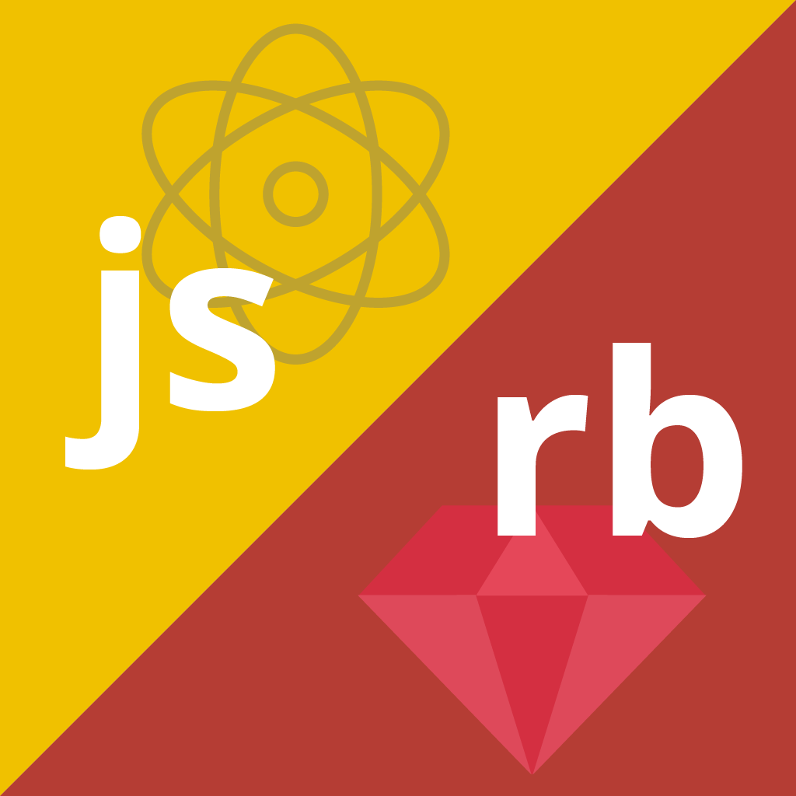
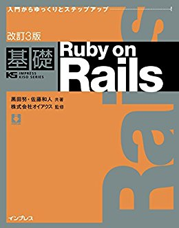

<!-- slide  class="center" -->
テクノロジー (藤原)
===================

第17回 10/11 (水)
-----------------

------------------------------------------------------------------------



藤原 由来 (ふじわら ゆき)
sky.y.0079@gmail.com

<!-- slide -->
目次
====

-   第2回アプリ制作課題
-   Rubyプロジェクトを作る
-   課題：実行ログをGitHubにプッシュ
    -   ベーシックコースのみ
-   振り返りシートに記入

<!-- slide -->
次回授業の案内
==============



-   次回授業は10/25(水)です
    -   10/18(水)は休み
-   教科書『基礎 Ruby on Rails』を持ってきてください
    -   今日はなくても構いません
    -   次回以降、**毎回**持ってきてください
-   今日帰ったらやること（いま手元にない人）
    -   家で教科書を探し、すぐ出せる場所に置く
    -   可能なら、明日持って行けるようカバンに入れておく

<!-- slide class="center" -->
第2回アプリ制作課題
===================

<!-- slide -->
第2回アプリ制作課題：概要
=========================

-   作品提出締切(共通): **11/1(水) 9:19**
    -   GitHubリポジトリにpushすること（詳細は後日）
-   アドバンスドコース：**プレゼンあり** (1回)
    -   発表日は同日 (11/1)
-   ベーシックコース：**今回はプレゼンなし**

<!-- slide -->
第2回課題：アドバンスド
=======================

-   作品提出：GitHubリポジトリにpushしてください
    -   リポジトリの案内は後日
-   プレゼン：5分 (**デモを含めること**)
-   制作期間がかなり短いので注意
    -   Railsなどのフレームワークを使用する場合は、第2回と第3回を合わせて一つのアプリとしても構いません

<!-- slide -->
授業用サイトにまとめました
==========================

-   [第2回 サーバサイドスクリプトの制作](https://kd-site2017.firebaseapp.com/project2-server-app/)
-   [Webアプリ制作課題：Q&A](https://kd-site2017.firebaseapp.com/project-q-and-a/)

<!-- slide -->
アドバンスドコース：作業開始
============================

-   10月の予定（授業日：10/11, 25）を提出してください
    -   <https://goo.gl/forms/YaV8cahqer4odNNF2>
-   今週から、第1回課題と同様にTrelloでタスク管理をしてもらいます
    1.  まず「今日やるタスク」に、授業までにやるタスクを積む
    2.  これから始めるタスクを「今やっているタスク」に移動
    3.  **終わったタスクを「終了したタスク」に移動して、授業を終える**

<!-- slide -->
ベーシック：第2回アプリ制作課題
===============================

-   今回は期間が短いので、サンプル課題を用意しています
-   サンプル課題以外の場合
    -   第1回と同様に、自身でオリジナルのRubyアプリを作ってもかまいません
    -   その場合、README.mdにアプリの説明を書いてもらいます

<!-- slide -->
第2回アプリ制作課題（サンプル課題）
===================================

-   指定した**Webサイト**から特定の**表**を抜き出し、**端末（標準出力）**に出力しなさい
-   Webサイト: [DebianReleases - Debian Wiki](https://wiki.debian.org/DebianReleases)
-   表: Production Releases
    -   Debian (Raspbian, Ubuntuなどの元) のバージョンやリリース日がまとめられた表
    -   **表は2つあることに注意**
-   端末（標準出力）: Cloud9上の「Bash」

<!-- slide data-background-image="images/DebianReleases1.jpg" data-background-size="contain" -->
<!-- slide data-background-image="images/DebianReleases2.jpg" data-background-size="contain" -->
<!-- slide -->
サンプル課題：採点基準 (1)
==========================

-   採点基準
    -   最低要件を満たしている
    -   どれだけ美しく表を端末に表示できるか（次スライド）
-   最低要件：表「Production Releases」が、とにかく端末内で表示されている
    -   形式は問わない: 生のHTMLでもいい
    -   余計なものが表示されていてもいい: 前後の要素などが表示されていてもいい

<!-- slide -->
サンプル課題：採点基準 (2)
==========================

-   加点するケース
    -   表「Production Releases」だけが表示されている
        -   同名の見出し `<h2>` はあってもなくてもよい
    -   余計なHTMLタグが取り除かれている
    -   表の見た目に近い

<!-- slide -->
サンプル課題：ヒント
====================

-   あとで紹介するライブラリ(Gem)の「nokogiri」を使用します
    -   1つのHTMLから要素を抜き出すためのライブラリ
-   まずはHTMLを直接読んでみてください
    -   Chrome Dev Tools (`F12`)などを使ってみよう

<!-- slide class="center" -->
Rubyプロジェクトを作る
======================

（ベーシックコース）

<!-- slide -->
演習の準備: Cloud9
==================

-   Cloud9でログインする (GitHubアカウント)
    -   <https://c9.io/auth/github?r=/dashboard.html>
-   前回作った自分のWorkspaceで、「Open」をクリック

<!-- slide data-background-image="images/cloud9_workspaces2.jpg" data-background-size="contain" -->
<!-- slide -->
新しいディレクトリを作成
========================

Cloud9のBash（画面下部）で実行

``` bash
$ mkdir wec-ruby1011
$ cd wec-ruby1011
```

<!-- slide -->
演習の準備: 課題用リポジトリ(GitHub)
====================================

-   今回は、自分のリポジトリを一から作ってもらいます
-   <https://github.com/> にアクセス
    -   「＋」→「New Repository」
    -   Repository name:

<!-- slide 
data-background-image="images/GitHub1.jpg"
data-background-size="contain" -->
<!-- slide 
data-background-image="images/CreateRepository.jpg"
data-background-size="contain" -->
<!-- slide 
data-background-image="images/sky-y-wec-ruby1011.jpg"
data-background-size="contain" -->
<!-- slide -->
gitコマンドを使ってリポジトリを新規作成
=======================================

-   先ほどのGitHub上のコマンドを1行ずつコピー
    -   「…or create a new repository on the command line」の方
-   Bashにペーストしていく
-   Gitリポジトリの状態は`git status`で確認できるので、ステップ毎に確かめてみよう

<!-- slide -->
Gitコマンドの解説 (1)
=====================

-   `echo "# wec-ruby1011" >> README.md`
    -   `echo`で標準出力に出し、`>>`でファイルに出力（追記）
-   `git init`: リポジトリを新規作成
-   `git add README.md`: README.mdをステージに上げる

<!-- slide -->
Gitコマンドの解説 (2)
=====================

-   `git commit -m "first commit"`
    -   “first commit”というメッセージでコミットする
-   `git remote add origin (URL)`
    -   URLをpushの対象とする
    -   `origin`という名前のリモートリポジトリとして登録
-   `git push -u origin master`: プッシュを実行
    -   ローカル: `master`, リモート: `origin/master`
    -   `-u`: デフォルトに登録 (次回以降は`git push`でOK)

<!-- slide -->
Gitを覚える心得
===============

-   `git status`でリポジトリの状態をこまめに確認しよう
-   ミスっても大抵は修復可能だと覚えておこう
    -   やりたいことをググると、大抵コマンドは載っている
    -   分からなくなったら藤原に相談してください
-   無理せず少しずつ覚えよう

<!-- slide -->
Rubyのツール群
==============

-   Ruby本体 (処理系)
-   `irb`, `pry` (対話型インタプリタ)
-   RubyGems `gem` (ライブラリ「Gem」とその管理ツール)
-   Bundler `bundle` (Gemをプロジェクト毎に管理するツール)

<!-- slide -->
RubyGems
========

-   Gem: 1つのライブラリ
-   RubyGems: Gemを管理するツール
-   `gem` コマンド: RubyGems用のコマンド
    -   Pythonの`pip`, Debianの`apt-get`と似ている

<!-- slide -->
例：pryをインストールする
=========================

-   `pry`: irbより高性能で便利な対話型インタプリタ
    -   標準で入っていないので、`gem`コマンドでインストール

``` bash
$ sudo gem install pry
Fetching: coderay-1.1.2.gem (100%)
Successfully installed coderay-1.1.2
(中略)
3 gems installed
$ pry
[1] pry(main)> 
```

<!-- slide -->
pryの終了
=========

-   Windows: Ctrl+D
-   Mac: control+D (Commandではない！)
-   またはpry上で `quit` を打ってEnter

<!-- slide -->
Bundler
=======

-   Gemをプロジェクトごとに管理するためのツール
    -   `bundle`コマンドを使う
-   なぜ必要か？
    -   違う環境でも同じGemの同じバージョンを使えるようにするため
    -   Gemのバージョンが微妙に違うとアプリが動かなくなることがあるため

<!-- slide -->
Bundlerのファイル
=================

-   `Gemfile`
    -   開発時に使用するGemを記述するファイル
-   `Gemfile.lock`
    -   BundlerでGemをインストールしたあとにできるファイル
    -   `Gemfile.lock`が既に存在する場合、Bundlerはこちらの記述を優先してインストールしようとする
    -   プロジェクトの引き継ぎの際には重要

<!-- slide -->
bundleコマンドをインストールする
================================

``` bash
$ sudo gem install bundler
Fetching: bundler-1.15.4.gem (100%)
Successfully installed bundler-1.15.4
1 gem installed
```

<!-- slide -->
bundleコマンド: 空のGemfileを生成
=================================

``` bash
$ bundle init
Writing new Gemfile to 
/home/ubuntu/workspace/wec-ruby1011/Gemfile
```

<!-- slide -->
bundleコマンド: Gemfileを編集
=============================

-   ファイルツリーでGemfileを開き、以下を最終行に追記
    -   今回は「nokogiri」というGemをインストールしてみる

``` gemfile
gem "nokogiri"
```

<!-- slide -->
bundleコマンド: インストール
============================

-   Bashで実行

``` bash
$ bundle install
Fetching gem metadata from https://rubygems.org/.............
(中略)
Fetching nokogiri 1.8.1
Installing nokogiri 1.8.1 with native extensions
(時間がかかる)
```

<!-- slide -->
試してみる: Rubyファイルを作成
==============================

-   Cloud9のファイルツリー
    -   「wec-ruby1011」の上で右クリック
    -   「New File」
-   ファイル名を「nokogiri.rb」として新規作成
    -   ダブルクリックして開く

<!-- slide -->
nokogiri.rbに以下をコピペ
=========================

``` ruby
require 'open-uri'
require 'nokogiri'

url = 'http://kobedenshi.ac.jp/'

html = open(url) do |f|
  f.read
end

doc = Nokogiri::HTML.parse(html)
p doc.title
```

<!-- slide -->
試してみる: 実行
================

Cloud9のBashで実行

``` bash
$ ruby nokogiri.rb
```

<!-- slide -->
参考: nokogiri自体の説明
========================

来週改めてやる予定です。

-   [Nokogiriを使ったRubyスクレイピング \[初心者向けチュートリアル\] | 酒と涙とRubyとRailsと](http://morizyun.github.io/blog/ruby-nokogiri-scraping-tutorial/index.html)
-   公式リファレンス（英語）
    -   [Documentation for sparklemotion/nokogiri (master)](http://www.rubydoc.info/github/sparklemotion/nokogiri)

<!-- slide class="center" -->
課題：実行ログをGitHubにプッシュ
================================

-   ベーシックコースのみ
-   Cloud9上でREADME.mdに以下を追記
    -   `## 実行ログ`
    -   Bash上のログ（本日分全て）をコピーし貼り付ける
-   Gitでプッシュを実行
    -   `git status`でリポジトリ状態を確認してみよう

``` bash
$ git add *
$ git commit -m '10/11 実行ログ'
$ git push
```

<!-- slide -->
振り返りシートに記入
====================

-   振り返りシート（Googleフォーム）
    -   <https://goo.gl/forms/ra5k4sDiWiDJrGH93>
-   コース選択希望調査（ベーシック or アドバンスド）
    -   今回で正式に決定します
-   アドバンスドの人は、Trelloで今回やったタスクを「終了したタスク」に移動してください

<!-- slide -->
Q&A
===

-   何か質問があれば、いつでも気軽にメールしてください。
-   sky.y.0079@gmail.com

